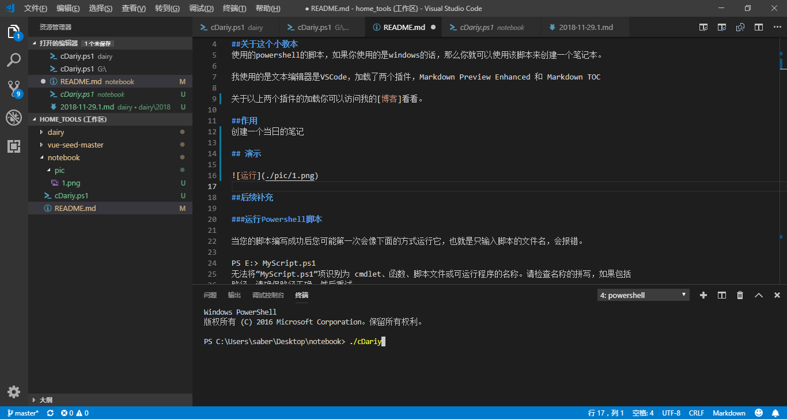
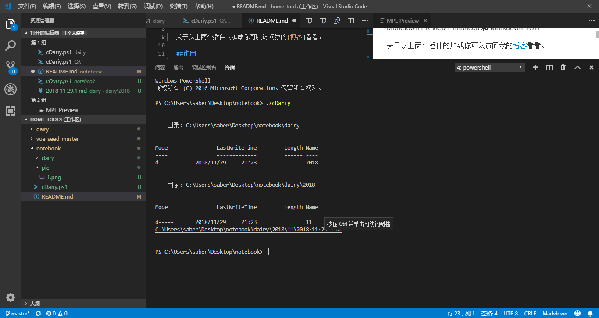
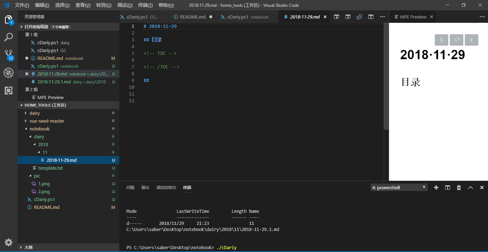

# notebook
每日笔记本

<!-- TOC -->

- [notebook](#notebook)
    - [关于这个小教本](#%E5%85%B3%E4%BA%8E%E8%BF%99%E4%B8%AA%E5%B0%8F%E6%95%99%E6%9C%AC)
    - [作用](#%E4%BD%9C%E7%94%A8)
    - [演示](#%E6%BC%94%E7%A4%BA)
    - [关于template的问题](#%E5%85%B3%E4%BA%8Etemplate%E7%9A%84%E9%97%AE%E9%A2%98)
    - [后续补充](#%E5%90%8E%E7%BB%AD%E8%A1%A5%E5%85%85)
        - [运行Powershell脚本](#%E8%BF%90%E8%A1%8Cpowershell%E8%84%9A%E6%9C%AC)
        - [执行策略限制](#%E6%89%A7%E8%A1%8C%E7%AD%96%E7%95%A5%E9%99%90%E5%88%B6)

<!-- /TOC -->
## 关于这个小教本
使用的powershell的脚本，如果你使用的是windows的话，那么你就可以使用该脚本来创建一个笔记本。

我使用的是文本编辑器是VSCode，加载了两个插件，Markdown Preview Enhanced 和 Markdown TOC 

关于以上两个插件的加载你可以访问我的[博客]看看。

## 作用
创建一个当日的笔记

## 演示

- 运行


- 首次运行：最后会有个链接，按住ctrl单击可以访问创建好的文件


- 文件展示



## 关于template的问题

这个文件是一个模板，里面一共有四行，开头空两行是用来加载标题的，第一个二级目录是 "目录"，下面一个块补充区域，

```md
<!-- TOC -->

<!-- /TOC -->
```
在该区域会出现一个目录，如果你加载了VScode的 Markdown TOC的话，它会自动给你更新一个目录的。

## 后续补充

### 运行Powershell脚本

当您的脚本编写成功后您可能第一次会像下面的方式运行它，也就是只输入脚本的文件名，会报错。

PS E:> MyScript.ps1
无法将“MyScript.ps1”项识别为 cmdlet、函数、脚本文件或可运行程序的名称。请检查名称的拼写，如果包括
路径，请确保路径正确，然后重试。
所在位置 行:1 字符: 13
+ MyScript.ps1 < <<<
+ CategoryInfo : ObjectNotFound: (MyScript.ps1:String) [], CommandNotFoundException
+ FullyQualifiedErrorId : CommandNotFoundException

Suggestion [3,General]: 未找到命令 MyScript.ps1，但它确实存在于当前位置。Windows PowerShell 默认情况
下不从当前位置加载命令。如果信任此命令，请改为键入 ".MyScript.ps1"。有关更多详细信息，请参阅 "get-h
elp about_Command_Precedence"。
除非您使用相对路径，或者绝对路径

```cmd
PS E:> .\MyScript.ps1
 
2012年4月27日 8:33:03
C:\Program Files\Common Files
files count
20
 
PS E:> E:MyScript.ps1
 
2012年4月27日 8:33:11
C:\Program Files\Common Files
files count
20
```

### 执行策略限制
Powershell一般初始化情况下都会禁止脚本执行。脚本能否执行取决于Powershell的执行策略。
```cmd
PS E:> .\MyScript.ps1
```
无法加载文件 E:MyScript.ps1，因为在此系统中禁止执行脚本。有关详细信息，请参阅 "get-help about_sign
ing"。
所在位置 行:1 字符: 15
+ .MyScript.ps1 < <<<
+ CategoryInfo : NotSpecified: (:) [], PSSecurityException
+ FullyQualifiedErrorId : RuntimeException
只有管理员才有权限更改这个策略。非管理员会报错。

查看脚本执行策略，可以通过：


PS E:> Get-ExecutionPolicy
更改脚本执行策略，可以通过

```cmd
PS E:> Get-ExecutionPolicy
Restricted
PS E:> Set-ExecutionPolicy UnRestricted
```
执行策略更改
执行策略可以防止您执行不信任的脚本。更改执行策略可能会使您面临 about_Execution_Policies
帮助主题中所述的安全风险。是否要更改执行策略?
[Y] 是(Y) [N] 否(N) [S] 挂起(S) [?] 帮助 (默认值为“Y”): y
脚本执行策略类型为：Microsoft.PowerShell.ExecutionPolicy
查看所有支持的执行策略：
```cmd
PS E:> [System.Enum]::GetNames([Microsoft.PowerShell.ExecutionPolicy])
Unrestricted
RemoteSigned
AllSigned
Restricted
Default
Bypass
Undefined
Unrestricted:权限最高，可以不受限制执行任何脚本。
Default:为Powershell默认的策略：Restricted，不允许任何脚本执行。
AllSigned：所有脚本都必须经过签名才能在运行。
RemoteSigned：本地脚本无限制，但是对来自网络的脚本必须经过签名。
```

---
[博客]:https://blog.csdn.net/double_debug/article/details/84636703
